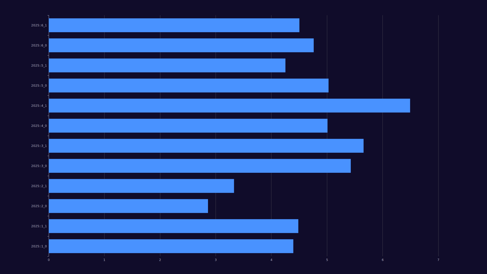

# Advent of Code

## Mindset

I did not agree with many of the overbearing design decisions of the existing AOC frameworks so I made my own with even more overbearing design decisions.

This code is a pet project for me to learn Rust concepts that I don't normally get to play with even if they aren't the best tool for the job, it is not "production ready" and it never will be. 

## Usage

See options using the `Just` command runner:
```bash
just
```

## Current benchmarks

These benchmarks were done without any true care for accuracy or attempting to control external variables so take them with a grain of salt:

Log scale benchmark results:



Results table:

<!-- Table insert start -->
<table>    <thead>        <tr>            <th>                <div>                    <p>                        Day                    </p>                </div>            </th>            <th>                <div>                    <p>                        Validated                    </p>                </div>            </th>            <th>                <div>                    <p>                        Average time                    </p>                </div>            </th>            <th>                <div>                    <p>                        Samples                    </p>                </div>            </th>            <th>                <div>                    <p>                        Total time                    </p>                </div>            </th>        </tr>    </thead>    <tbody>        <tr>            <td>                <div>                    <p>                        2025::1_0                    </p>                </div>            </td>            <td>                <div>                    <p>                        true                    </p>                </div>            </td>            <td>                <div>                    <p>                        24.861us                    </p>                </div>            </td>            <td>                <div>                    <p>                        100k                    </p>                </div>            </td>            <td>                <div>                    <p>                        2.486s                    </p>                </div>            </td>        </tr>        <tr>            <td>                <div>                    <p>                        2025::1_1                    </p>                </div>            </td>            <td>                <div>                    <p>                        true                    </p>                </div>            </td>            <td>                <div>                    <p>                        30.263us                    </p>                </div>            </td>            <td>                <div>                    <p>                        100k                    </p>                </div>            </td>            <td>                <div>                    <p>                        3.026s                    </p>                </div>            </td>        </tr>        <tr>            <td>                <div>                    <p>                        2025::2_0                    </p>                </div>            </td>            <td>                <div>                    <p>                        true                    </p>                </div>            </td>            <td>                <div>                    <p>                        747.348ns                    </p>                </div>            </td>            <td>                <div>                    <p>                        100k                    </p>                </div>            </td>            <td>                <div>                    <p>                        74.735ms                    </p>                </div>            </td>        </tr>        <tr>            <td>                <div>                    <p>                        2025::2_1                    </p>                </div>            </td>            <td>                <div>                    <p>                        true                    </p>                </div>            </td>            <td>                <div>                    <p>                        2.145us                    </p>                </div>            </td>            <td>                <div>                    <p>                        100k                    </p>                </div>            </td>            <td>                <div>                    <p>                        214.523ms                    </p>                </div>            </td>        </tr>        <tr>            <td>                <div>                    <p>                        2025::3_0                    </p>                </div>            </td>            <td>                <div>                    <p>                        true                    </p>                </div>            </td>            <td>                <div>                    <p>                        268.551us                    </p>                </div>            </td>            <td>                <div>                    <p>                        18k                    </p>                </div>            </td>            <td>                <div>                    <p>                        5.000s                    </p>                </div>            </td>        </tr>        <tr>            <td>                <div>                    <p>                        2025::3_1                    </p>                </div>            </td>            <td>                <div>                    <p>                        true                    </p>                </div>            </td>            <td>                <div>                    <p>                        453.066us                    </p>                </div>            </td>            <td>                <div>                    <p>                        11k                    </p>                </div>            </td>            <td>                <div>                    <p>                        5.000s                    </p>                </div>            </td>        </tr>        <tr>            <td>                <div>                    <p>                        2025::4_0                    </p>                </div>            </td>            <td>                <div>                    <p>                        true                    </p>                </div>            </td>            <td>                <div>                    <p>                        98.097us                    </p>                </div>            </td>            <td>                <div>                    <p>                        50k                    </p>                </div>            </td>            <td>                <div>                    <p>                        5.000s                    </p>                </div>            </td>        </tr>        <tr>            <td>                <div>                    <p>                        2025::4_1                    </p>                </div>            </td>            <td>                <div>                    <p>                        true                    </p>                </div>            </td>            <td>                <div>                    <p>                        2.911ms                    </p>                </div>            </td>            <td>                <div>                    <p>                        1k                    </p>                </div>            </td>            <td>                <div>                    <p>                        5.002s                    </p>                </div>            </td>        </tr>        <tr>            <td>                <div>                    <p>                        2025::5_0                    </p>                </div>            </td>            <td>                <div>                    <p>                        true                    </p>                </div>            </td>            <td>                <div>                    <p>                        102.834us                    </p>                </div>            </td>            <td>                <div>                    <p>                        48k                    </p>                </div>            </td>            <td>                <div>                    <p>                        5.000s                    </p>                </div>            </td>        </tr>        <tr>            <td>                <div>                    <p>                        2025::5_1                    </p>                </div>            </td>            <td>                <div>                    <p>                        true                    </p>                </div>            </td>            <td>                <div>                    <p>                        18.934us                    </p>                </div>            </td>            <td>                <div>                    <p>                        100k                    </p>                </div>            </td>            <td>                <div>                    <p>                        1.893s                    </p>                </div>            </td>        </tr>        <tr>            <td>                <div>                    <p>                        2025::6_0                    </p>                </div>            </td>            <td>                <div>                    <p>                        true                    </p>                </div>            </td>            <td>                <div>                    <p>                        53.511us                    </p>                </div>            </td>            <td>                <div>                    <p>                        93k                    </p>                </div>            </td>            <td>                <div>                    <p>                        5.000s                    </p>                </div>            </td>        </tr>        <tr>            <td>                <div>                    <p>                        2025::6_1                    </p>                </div>            </td>            <td>                <div>                    <p>                        true                    </p>                </div>            </td>            <td>                <div>                    <p>                        37.275us                    </p>                </div>            </td>            <td>                <div>                    <p>                        100k                    </p>                </div>            </td>            <td>                <div>                    <p>                        3.727s                    </p>                </div>            </td>        </tr>        <tr>            <td>                <div>                    <p>                        2025::7_0                    </p>                </div>            </td>            <td>                <div>                    <p>                        true                    </p>                </div>            </td>            <td>                <div>                    <p>                        39.510us                    </p>                </div>            </td>            <td>                <div>                    <p>                        100k                    </p>                </div>            </td>            <td>                <div>                    <p>                        3.951s                    </p>                </div>            </td>        </tr>        <tr>            <td>                <div>                    <p>                        2025::7_1                    </p>                </div>            </td>            <td>                <div>                    <p>                        true                    </p>                </div>            </td>            <td>                <div>                    <p>                        44.903us                    </p>                </div>            </td>            <td>                <div>                    <p>                        100k                    </p>                </div>            </td>            <td>                <div>                    <p>                        4.490s                    </p>                </div>            </td>        </tr>        <tr>            <td>                <div>                    <p>                        totals                    </p>                </div>            </td>            <td>                <div>                    <p>                        true                    </p>                </div>            </td>            <td>                <div>                    <p>                        4.086ms                    </p>                </div>            </td>            <td>                <div>                    <p>                        1M                    </p>                </div>            </td>            <td>                <div>                    <p>                        49.866s                    </p>                </div>            </td>        </tr>    </tbody></table>
<!-- Table insert end -->
